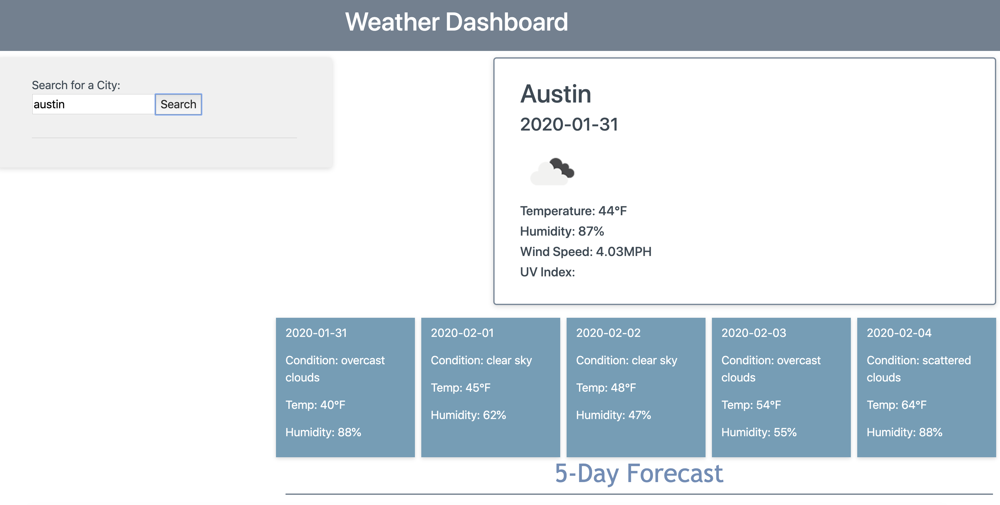

# weatherDashboard
This weather dashboard takes data from the openweather API and allows you to check the current weather and a 5-day forecast of any city you want. Here is a link to the live server:
https://mgonza63.github.io/weatherDashboard/ 
[GitHub-repo](https://mgonza63.github.io/weatherDashboard/)




* I managed to get the three data collections to work, but for some reason the uv index would stop working and crash the website
    * I commented it out, so you don't experience any problems.

```javascript
          var lon = response.coord.lon;
          var lat = response.coord.lat;
          var uvKey = "d68917803103c196cc3a57791401fdc9";

          var uvURL = "https://api.openweathermap.org/data/2.5/uvi?appid=" + uvKey + "&lat=" + lat + "&lon=" + lon;
          
          $.ajax({
             url: uvURL,
             method: "GET"
           }).then(function(data) {

             $("#uv").text("UV Index: " + data.value);

```
* Another problem that I encountered is that the icon for the weather shows on my project, but not on the live server
* I also could not get the localStorage to work, I need some practice with that.


Overall, I am really proud of this project, I thought I did a good job and, I learned a lot from it. It was fun to play around with the API, and I can't imagine all the things that can be done with them!
